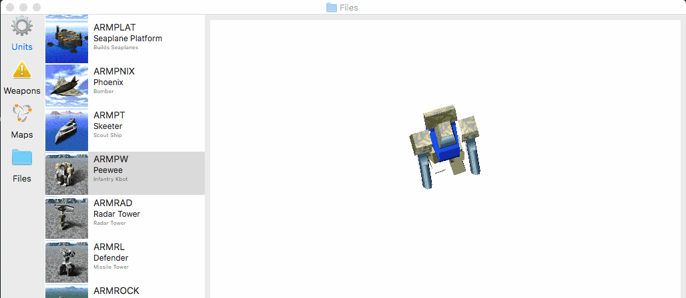

# SwiftTA

I like [Swift](https://swift.org); but I'd like to get to know it better outside of my day job: writing iOS apps and libraries. So I've decided to retrace the steps of an old project I worked on ages ago: [writing a clone of Total Annihilation](https://github.com/loganjones/nTA-Total-Annihilation-Clone).

This repository is a collection of Swift (and some C) code that works with Total Annihilation's assets. Currently, there are a couple of macOS applications, [TAassets](#taassets) and [HPIView](#hpiview), that browse TA archive files (HPI & UFO files) and shows a preview of its contents.

## TAassets

A macOS application that browses all of the assets contained in the TA archive files (HPI & UFO files) of a TA install directory. With this you can see the "virtual" file-sytem heirarchy that TA uses to load its assets. Additionally, you can browse specific categories (like units) to see a more complete representation (model + textures + animations).

You will need a Mac (natch) and a Total Annihilation installation somewhere on your browsable file-system. TAassets will read the files just as TA would; so any downloadable unit (a UFO) or other third-party material should "just work".

## HPIView

A macOS application that browses the TA archive files (HPI & UFO files) and shows a preview of its contents. This is similar to an old Windows program (which I believe had the same name).

You will need a Mac and an HPI file or two. You can find these in Total Annihilation's main install directory. Any downloadable unit (a UFO) will work as well. As a bonus, you can also browse Total Annihilation: Kingdoms HPI files.

## Next Steps

Next up will be a simple game client. Something we can load a map and some units into.
