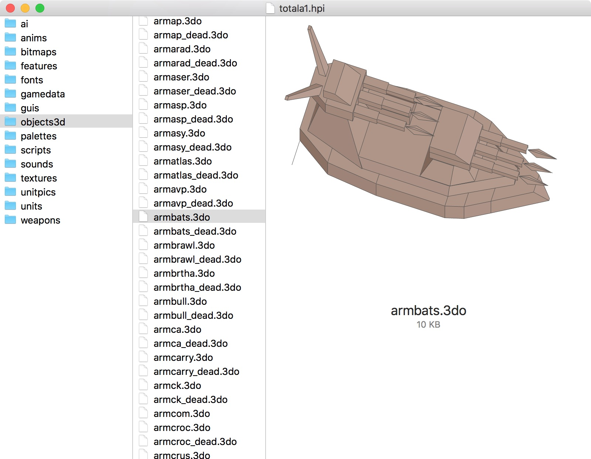

# SwiftTA

I like [Swift](https://swift.org); but I'd like to get to know it better outside of my day job: writing iOS apps and libraries. So I've decided to retrace the steps of an old project I worked on ages ago: [writing a clone of Total Annihilation](https://github.com/loganjones/nTA-Total-Annihilation-Clone).

This repository is a collection of Swift (and some C) code that works with Total Annihilation's assets. Currently, there is a macOS application, [HPIView](#hpiview), that browses TA archive files (HPI & UFO files) and shows a preview of its contents.

## HPIView

A macOS application that browses the TA archive files (HPI & UFO files) and shows a preview of its contents. This is similar to an old Windows program (which I believe had the same name).

You will need a Mac (natch) and an HPI file or two. You can find these in Total Annihilation's main install directory. Any downloadable unit (a UFO) will work as well. As a bonus, you can also browse Total Annihilation: Kingdoms HPI files.

HPIView is a starting point. Once we know we can open, read, and inspect TA's files we can begin working with them.

## Next Steps

Next up will be an 'asset' viewer. This is similar to HPIView; but the asset viewer will index the entirety of a TA install directory (ie. many HPIs) and allow you to browse the aggregate working tree of files. Additionally, you should be able to browse specific categories (like units) to see a more complete representation (model + textures + animations).
