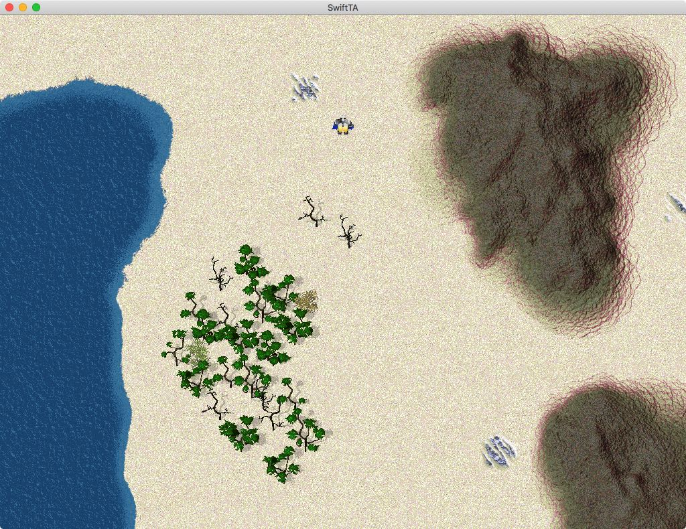

# SwiftTA

I like [Swift](https://swift.org); but I'd like to get to know it better outside of my day job: writing iOS apps and libraries. So I've decided to retrace the steps of an old project I worked on ages ago: [writing a clone of Total Annihilation](https://github.com/loganjones/nTA-Total-Annihilation-Clone).

Currently, there is a simple game client (macOS, iOS, Linux) that loads up a hardcoded map and displays a single unit. See the [Build](#build) section for information on building and running the client.



Additionally, there are a couple of macOS applications, [TAassets](#taassets) and [HPIView](#hpiview), that browse TA archive files (HPI & UFO files) and shows a preview of its contents.

## Build

#### macOS & iOS

Use the SwiftTA workspace (SwiftTA.xcworkspace) to build the macOS and/or the iOS game client.

#### Linux

The Linux build was developed using the official Swift 4.2 binaries for Ubuntu 16.04 from Swift.org. Additionally, the following packages are necessary to build:
```
clang libicu-dev libcurl3 libglfw3-dev libglfw3 libpng-dev
```

To build the game target, use a terminal to run `swift build` from the `SwiftTA/SwiftTA Linux` directory. To run the game, use `swift run`.

#### Windows

😅 ... yeah, about that. I haven't been able to get a build of the Swift compiler working on my Windows machine. It would be much easier if there were official builds available from Swift.org or even from Microsoft; but that is not a reality yet; maybe after Swift 5 and the ABI work? Another complication would be the lack of a C++ interface.

## Game Assets

Running the current game client requires that the Total Annihilation game files be accessible in your current user's Documents directory. More specifically, the game is hardcoded to look in `~/Documents/Total Annihilation` for any .hpi files (or .ufo, .ccx, etc). This is certainly a hack and will be addressed in the future. Note: a symbolic link to another directory is acceptable; though the link must be named `Total Annihilation`.

#### iOS

On iOS, this is difficult due to the lack of direct filesystem access. The easiest way to get the files into the right place is to run the game app once; and then use iTunes to copy the `Total Annihilation` directory over to the app's container. Find [device] -> File Sharing -> SwiftTA and just drag-and-drop the entire folder.

#### Linux

To run the game, use `swift run` from the `SwiftTA/SwiftTA Linux` directory (this will also build the project if it hasn't been built already).

Note: You will need an OpenGL 3.0 capable graphics driver to run the game. For development, I've been using the default driver in a VMWare Fusion install.

## TAassets


A macOS application that browses all of the assets contained in the TA archive files (HPI & UFO files) of a TA install directory. With this you can see the "virtual" file-sytem hierarchy that TA uses to load its assets. Additionally, you can browse specific categories (like units) to see a more complete representation (model + textures + animations).

You will need a Mac (natch) and a Total Annihilation installation somewhere on your browsable file-system. TAassets will read the files just as TA would; so any downloadable unit (a UFO) or other third-party material should "just work".

## HPIView


A macOS application that browses the TA archive files (HPI & UFO files) and shows a preview of its contents. This is similar to an old Windows program (which I believe had the same name).

You will need a Mac and an HPI file or two. You can find these in Total Annihilation's main install directory. Any downloadable unit (a UFO) will work as well. As a bonus, you can also browse Total Annihilation: Kingdoms HPI files.

## Next Steps

Continuous iteration on the game client. Real unit loading. A full object system. UI interaction. So much to do.
